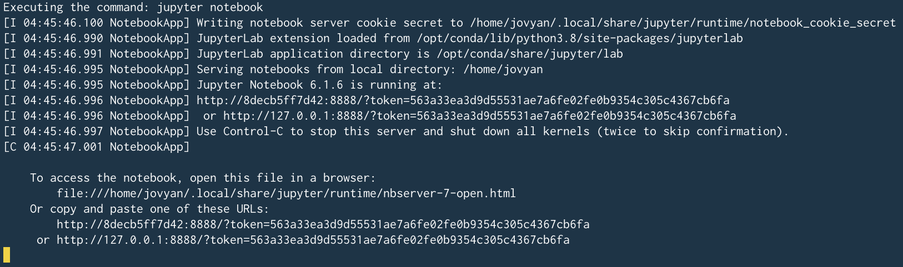

# Introduction

I'm taking classes in Machine Learning for Winter 2021, at UC Irvine. We're required to do quite a lot of assignments and projects using Python and submit them. With my love for docker slowly increasing over the past few years, I decided to see if I could setup my local environment using docker. And based on the title of the blog post, you know that I found a way. 😄

We're going to setup a Jupyter notebook based environment.

# TL;DR

It's as simple as running this in your terminal. More detailed information is provided below

```
docker run -p 8888:8888 --name jupyter-notebook jupyter/tensorflow-notebook
```

# Setup

1. Make sure you have docker installed and running. You can find instructions for your OS [here](https://docs.docker.com/get-docker/).
1. I'll use the `jupyter/tensorflow-notebook` image as mentioned [here](https://jupyter-docker-stacks.readthedocs.io/en/latest/using/selecting.html#jupyter-tensorflow-notebook). You could choose any other image as per your needs as well.
1. Run `docker run` `-p 8888:8888` `--name jupyter-notebook` `jupyter/tensorflow-notebook` in a terminal to
   1. Download the `jupyter/tensorflow-notebook` image. **Warning: Around 3.5GB.**
   1. Create a container named jupyter-notebook.
   1. Map the internal 8888 port from the docker container to your host's 8888 port.
1. Now that you have a working Jupyter notebook setup, you should see a URL starting with http://127.0.0.1:8888/ in your terminal. Click on it and test out your first notebook! Note that the URL in the terminal has a login token that automatically signs you into the environment.

For reference, once you run the above command, you should see something like this in the terminal



The docker image comes with Python 3 pre-installed, along with a bunch of ML libs like numpy, matplotlib, TensorFlow, Keras etc. You can create a Python 3 notebook and run the following code to verify the TensorFlow version

```
import tensorflow as tf
print(tf.__version__)
```

# Other things to do

I will be using `jupyter-notebook` everywhere below, as I've named my container as that. You can substitute it with whatever name you chose during the `run` command. Also remember that you don't necessarily need to name your container. You could also just reference it by the unique id it is assigned. To see your container, run `docker ps -a`.

## Stop/start your container

Use `Ctrl + C` in the terminal that you've run the `run` command to kill the container. You can also run `docker stop jupyter-notebook` in another terminal. But I don't know why you would want to do that. 🤷

Remember that the state is saved and when you restart the container, you can just continue. Run `docker start -a jupyter-notebook` to start the container and attach the output of the container to your terminal.

## Accessing container's terminal

There are two ways, and either seems to do the job

1. Run `docker exec` `-it jupyter-notebook` `/bin/bash` in another terminal on your machine.
1. Create a new terminal from within the Jupyter notebook environment using the "New" menu option on the top-right.

## Creating container with a shared folder

It's highly likely that you have some data on your machine and you'd want to create a notebook there. Or would just like to use existing notebooks on a folder on your machine. There is an option `-v` as part of the `run` command, that you can use to "mount" a folder onto your docker container. I might be messing up terminologies, but it basically lets you share a folder with your docker container. Imagine you wanted to share a folder `/usr/code/ml` with your container. You could run the same `run` command as before, using `-v` `/usr/code/ml:/home/jovyan/dev`.

This gives access to the `usr/code/ml` folder on your machine to the docker container and is accessible at `/home/jovyan/dev`. This path in the docker container is specific to this image, as the `jupyter notebook` command is run in this folder when you create the container.

An astute observer would've noticed that I said use `-v` when you `run`. Yes, that's right. You can't share a folder with a container once it has been created already. So, you can't use the `-v` option with `docker start`, for instance.

# Conclusion

I hope this was a nice real world example of using docker to setup an ML environment. I love docker because it's fast, intuitive, and also pretty much an industry standard for containerization. Though I've used docker for micro-services in the past, and also seen Kubernetes in production, I really like using docker for my personal use for stuff like this. I have found some other nice personal use cases that I hope to write about in the future!
